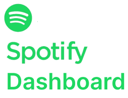
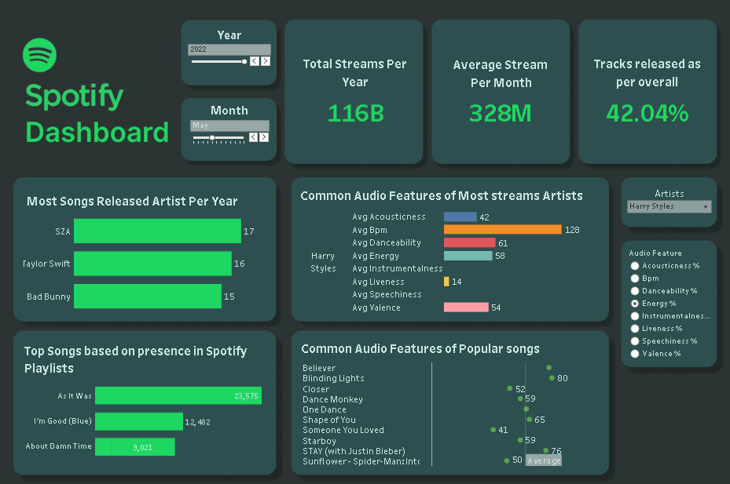

<!-- PROJECT LOGO -->
 

  

  <h3 align="center">SQL and Tableau Project: Spotify Analytics Dashboard</h3>

  

    An End to End Data Analysis and Visualization!
     
     
     
  

<!-- ABOUT THE PROJECT -->
## About The Project

 

 

In this project, we dug into a dataset showcasing the famous tracks of 2023, straight from Spotify's charts. This dataset goes beyond the usual dataset of streaming platform, containing a load of fields. It provides insights into each song's attributes, popularity, and presence on various music platforms. The dataset includes information such as track name, artist(s) name, release date, Spotify playlists and charts, streaming statistics, Apple Music presence, Deezer presence, Shazam charts, and various audio features.

To make sense of all this data, we split the data into two tables, each with the relevant field for effective data analysis. After performing data cleaning, we dove into some quick data exploration once everything was all set for analysis. Finally, we brought it into Tableau to sprinkle its magic and jazz things up with data visualizations.

### Audience

Target Audience: Spotify Platform Profesionals

Professionals working within these platforms can leverage the dashboard to assess streaming trends over time, audio features and their correlations with track popularity and artist popularity. It can make help them generate spotify playlists better, improve user experience, and  guide promotional efforts for a certain artist/s.

### Built With

* 
* 
* 

<!-- ACKNOWLEDGMENTS -->
## Resources

* [Spotify Dataset](https://www.kaggle.com/datasets/nelgiriyewithana/top-spotify-songs-2023/data)
* [Visit and Interact with the Dashboard](https://public.tableau.com/app/profile/jazley.manguino/viz/Project1_17016274333830/MainDashboard)

